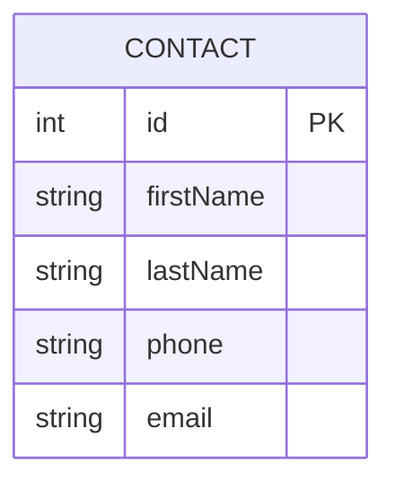

# ContactManager REST API

## Описание проекта
Реализация Java-приложения на Spring Framework для управления базой данных контактов.

## Модель данных
Контакт содержит следующие поля:
- **id** - уникальный идентификатор (генерируется автоматически)
- **firstName** - имя (обязательное)
- **lastName** - фамилия (обязательное)
- **phone** - телефонный номер (обязательное)
- **email** - электронная почта (опциональное)

## API Endpoints

### Получить все контакты
GET /contacts


**Ответ:**
```
[
    {
        "id": 1,
        "firstName": "Иван",
        "lastName": "Петров",
        "phone": "+79161234567",
        "email": "ivan@example.com"
    },
    {
        "id": 2,
        "firstName": "Мария",
        "lastName": "Иванова",
        "phone": "+79167654321",
        "email": "maria@example.com"
    }
]
```

### Получить конкретный контакт
```
GET /contacts/{id}
```

**Пример запроса:**
```
GET /contacts/1
```

**Ответ:**
```json
{
    "id": 1,
    "firstName": "Иван",
    "lastName": "Петров",
    "phone": "+79161234567",
    "email": "ivan@example.com"
}
```

### Создать новый контакт
```
POST /contacts
```

**Пример запроса:**
```json
{
    "firstName": "Алексей",
    "lastName": "Смирнов",
    "phone": "+79165554433",
    "email": "alex@example.com"
}
```

**Ответ:**
```json
{
    "id": 3,
    "firstName": "Алексей",
    "lastName": "Смирнов",
    "phone": "+79165554433",
    "email": "alex@example.com"
}
```

### Обновить существующий контакт
```
PUT /contacts/{id}
```

**Пример запроса:**
```
PUT /contacts/1
```

```json
{
    "firstName": "Иван",
    "lastName": "Петров",
    "phone": "+79169998877",
    "email": "ivan.new@example.com"
}
```

**Ответ:**
```json
{
    "id": 1,
    "firstName": "Иван",
    "lastName": "Петров",
    "phone": "+79169998877",
    "email": "ivan.new@example.com"
}
```

## Технологический стек
- Java 21+
- Spring Boot 3.x
- Spring Data JPA
- PostgreSQL
- Lombok
- Spring Validation

## Запуск приложения
1. Установите Maven и JDK 17+
2. Выполните команду:
```bash
mvn spring-boot:run
```
3. Приложение будет доступно по адресу: `http://localhost:8080`

## ER-диаграмма


## Рекомендации для production
1. Добавить пагинацию для GET /contacts
2. Реализовать валидацию телефонных номеров и email
3. Добавить аутентификацию (JWT)
4. Настроить логирование операций
5. Добавить интеграционные тесты
```
