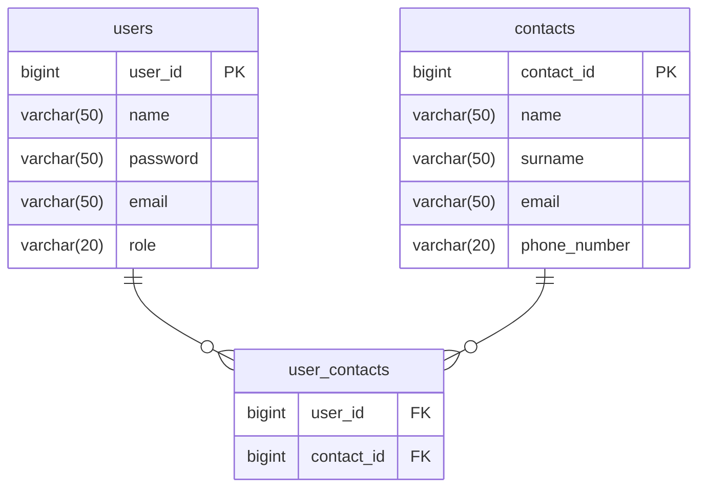

# Contact Manager API

## Описание проекта
RESTful веб-сервис для управления контактами, разработанный на Spring Boot. Позволяет создавать, читать, обновлять и удалять контакты через HTTP-запросы.

## Технологии
- Java 17
- Spring Boot 3.x
- Spring Data JPA
- PostgreSQL
- Maven/Gradle (в зависимости от конфигурации проекта)
- Lombok
- Spring Validation

## Требования
- Java 17 или выше
- Maven 3.6+ или Gradle 7.x+

## Установка и запуск

1. Клонируйте репозиторий:
   ```bash
   git clone https://github.com/yourusername/contact-manager.git
   cd contact-manager
   ```

2. Соберите проект:
   ```bash
   # Для Maven
   ./mvnw clean install
   
   # Или для Gradle
   ./gradlew build
   ```

3. Запустите приложение:
   ```bash
   # Для Maven
   ./mvnw spring-boot:run
   
   # Или для Gradle
   ./gradlew bootRun
   ```

Приложение будет доступно по адресу: `http://localhost:8080`

## Модель данных

### Контакт
```json
{
    "id": 1,
    "firstName": "Иван",
    "lastName": "Петров",
    "phone": "+79161234567",
    "email": "ivan@example.com"
}
```

### Поля
- **id** - уникальный идентификатор (генерируется автоматически)
- **firstName** - имя (обязательное, не может быть пустым)
- **lastName** - фамилия (обязательное, не может быть пустой)
- **phone** - телефонный номер (обязательное, валидация формата)
- **email** - электронная почта (опциональное, с валидацией формата)

## Документация API

### Базовый URL
Все эндпоинты доступны по базовому URL: `http://localhost:8080/api/`

### Коды ответов
- `200 OK` - успешный запрос
- `201 Created` - ресурс успешно создан
- `400 Bad Request` - неверные входные данные
- `403 Forbidden` - доступ запрещен
- `404 Not Found` - ресурс не найден
- `500 Internal Server Error` - внутренняя ошибка сервера

## Эндпоинты API

### Управление пользователями (только для администраторов)

#### Получить всех пользователей
```
GET /api/users
```

**Требуемая роль:** `ROLE_ADMIN`

**Ответ:**
```json
[
    {
        "id": 1,
        "username": "admin",
        "email": "admin@example.com",
        "roles": "ROLE_ADMIN"
    },
    {
        "id": 2,
        "username": "user1",
        "email": "user1@example.com",
        "roles": "ROLE_USER"
    }
]
```

#### Получить пользователя по ID
```
GET /api/users/{userId}
```

**Параметры пути:**
- `userId` - ID пользователя

**Требуемая роль:** `ROLE_ADMIN`

**Пример запроса:**
```
GET /api/users/1
```

**Ответ:**
```json
{
    "id": 1,
    "username": "admin",
    "email": "admin@example.com",
    "roles": "ROLE_ADMIN"
}
```

#### Обновить пользователя
```
PUT /api/users/{userId}
```

**Параметры пути:**
- `userId` - ID пользователя для обновления

**Требуемая роль:** `ROLE_ADMIN`

**Тело запроса:**
```json
{
    "username": "updatedUser",
    "email": "updated@example.com",
    "password": "newPassword123"
}
```

**Ответ:**
```json
{
    "id": 1,
    "username": "updatedUser",
    "email": "updated@example.com",
    "roles": "ROLE_USER"
}
```

#### Удалить пользователя
```
DELETE /api/users/{userId}
```

**Параметры пути:**
- `userId` - ID пользователя для удаления

**Требуемая роль:** `ROLE_ADMIN`

**Пример запроса:**
```
DELETE /api/users/2
```

**Успешный ответ:**
```
204 No Content
```

### Управление контактами

#### Получить все контакты
```
GET /api/contacts
```
**Ответ:**
```
[
    {
        "id": 1,
        "firstName": "Иван",
        "lastName": "Петров",
        "phone": "+79161234567",
        "email": "ivan@example.com"
    },
    {
        "id": 2,
        "firstName": "Мария",
        "lastName": "Иванова",
        "phone": "+79167654321",
        "email": "maria@example.com"
    }
]
```

### Получить конкретный контакт
```
GET /contacts/{id}
```

**Пример запроса:**
```
GET /contacts/1
```

**Ответ:**
```json
{
    "id": 1,
    "firstName": "Иван",
    "lastName": "Петров",
    "phone": "+79161234567",
    "email": "ivan@example.com"
}
```

### Создать новый контакт
```
POST /contacts
```

**Пример запроса:**
```json
{
    "firstName": "Алексей",
    "lastName": "Смирнов",
    "phone": "+79165554433",
    "email": "alex@example.com"
}
```

**Ответ:**
```json
{
    "id": 3,
    "firstName": "Алексей",
    "lastName": "Смирнов",
    "phone": "+79165554433",
    "email": "alex@example.com"
}
```

### Обновить контакт
```
PUT /api/contacts/{id}
```

**Параметры пути:**
- `id` - ID контакта для обновления

**Пример запроса:**
```
PUT /api/contacts/1
```

**Тело запроса:**
```json
{
    "firstName": "Иван",
    "lastName": "Петров",
    "phone": "+79161234567",
    "email": "new.email@example.com"
}
```

**Ответ:**
```json
{
    "id": 1,
    "firstName": "Иван",
    "lastName": "Петров",
    "phone": "+79169998877",
    "email": "ivan.new@example.com"
}
```

### Удалить контакт
```
DELETE /api/contacts/{id}
```

**Параметры пути:**
- `id` - ID контакта для удаления

**Пример запроса:**
```
DELETE /api/contacts/1
```

**Успешный ответ:**
```
204 No Content
```

## Обработка ошибок аутентификации и авторизации

### Ошибка 401 Unauthorized
```json
{
    "status": 401,
    "error": "Unauthorized",
    "message": "Полный аутентификационный заголовок не найден"
}
```

### Ошибка 403 Forbidden
```json
{
    "status": 403,
    "error": "Forbidden",
    "message": "Доступ запрещен. Недостаточно прав."
}
```

## Обработка ошибок валидации

### Формат ответа об ошибке
```json
{
    "timestamp": "2023-08-05T19:12:19.123+00:00",
    "status": 400,
    "error": "Bad Request",
    "message": "Validation failed",
    "path": "/api/v1/contacts",
    "details": [
        {
            "field": "phone",
            "message": "Номер телефона не соответствует формату"
        }
    ]
}
```

## Учетные данные по умолчанию

В системе предустановлена учетная запись администратора со следующими данными:

- **Логин:** `admin`
- **Пароль:** `12345678`
- **Email:** `admin@example.com`
- **Роль:** `ROLE_ADMIN`

Эта учетная запись создается автоматически при первом запуске приложения и имеет полные права доступа ко всем функциям системы.

## Примеры использования с аутентификацией

### Получение списка пользователей (требуется аутентификация администратора)
```bash
curl -X GET http://localhost:8080/api/users \
  -H "Authorization: Bearer ваш_jwt_токен"
```

### Обновление пользователя
```bash
curl -X PUT http://localhost:8080/api/users/1 \
  -H "Content-Type: application/json" \
  -H "Authorization: Bearer ваш_jwt_токен" \
  -d '{"username":"newUsername","email":"new@example.com","password":"newPassword123"}'
```

## ER-диаграмма


```mermaid
erDiagram
    users ||--o{ user_contacts : ""
    contacts ||--o{ user_contacts : ""
    
    users {
        bigint user_id PK
        varchar(50) name
        varchar(50) password
        varchar(50) email
        varchar(20) role
    }
    
    contacts {
        bigint contact_id PK
        varchar(50) name
        varchar(50) surname
        varchar(50) email
        varchar(20) phone_number
    }
    
    user_contacts {
        bigint user_id FK
        bigint contact_id FK
    }

```
## Возможные улучшения
1. Добавить пагинацию для GET /contacts
2. Настроить логирование операций
3. Добавить возможность смены ролей
